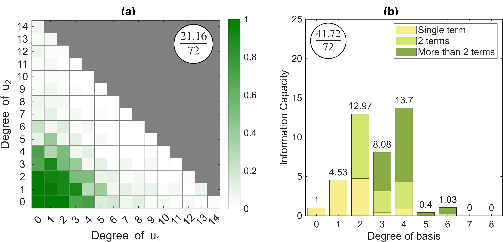

# infoprocap


*Figure 1: IPC Visualizations

A MATLAB toolkit for computing and visualizing **Information Processing Capacity (IPC)** of stationary physical systems using a multivariate Legendre polynomial basis.

All classes are accessed via the `infoprocap` namespace (e.g., `infoprocap.IPC`).

## Installation

Copy the `+infoprocap` folder into your MATLAB project's root directory.

## Requirements

- MATLAB R2019b or later — no external toolboxes needed

## Package Structure

```
+infoprocap/
├── IPC.m       % Core class — basis construction & capacity computation
├── Plotter.m   % Static plotting utilities
└── Utils.m     % Helper functions
```

---

## `IPC` — Core Class

Constructs a multivariate orthonormal Legendre polynomial basis and computes IPC from readouts.

### Constructor


- `u` —  input matrix (values in `[-1, 1]`)
- `max_deg` — maximum total degree of the Legendre polynomial product basis

### Key Properties

| Property | Description |
|---|---|
| `sample_size` / `basis_size` / `dimn` | No. of input samples, No. of basis terms, Input dimension |
| `u` | Input signal `[sample_size × dimn]` |
| `y` | Evaluated product basis terms `[sample_size × basis_size]` |
| `degrees` | Multi-index degree table `[basis_size × dimn]` (Used to generate product basis from individual polynomials) |


### Methods

**`C = calcCap(obj, X, sample_idxs, basis_idxs, use_bias)`**
Raw capacity from readouts `X`

**`C = fitCap(obj, X, sample_idxs, alg)`**
Fitted capacity after asymptotic fitting and false-positive thresholding.
- `alg = 1` — theoretical threshold
- `alg = 2` — threshold by minimum-negative value 

**`[C_hat, dC_hat] = estCap(obj, X, alg)`**
Capacity with split-half uncertainty estimate (`dC_hat`).

**`[samps_arr,Cm_arr] = scanCap(obj, X)`**
Scans capacity vs. number of training samples. Useful to visualise the asymptotic form of capacities.

**`initThresholds(obj, X, sample_idxs)`**
Pre-computes theoretical thresholds per basis term (required for `alg = 1`).

---

## `Plotter` — Visualization

Static class. Both methods accept a `filename` argument:

| Value | Behaviour |
|---|---|
| `"no_plot"` | Skip plotting |
| `"no_save"` | Display without saving |
| Any string | Save to file at 300 DPI |

**`Cm = Plotter.Cap_mat(obj, C, filename)`**
2D heatmap of capacity over polynomial degrees. Requires `dimn = 2`. [Figure 1(a)]

**`Cd = Plotter.Cap_deg(obj, C, filename,y_lim)`**
Stacked bar chart of capacity by total degree, split into single-feature, 2-feature cross, and higher-order interaction terms.  [Figure 1(b)]

---

## `Utils` — Helpers

**`Utils.dispPerc(i, len)`** — Prints progress percentage every 1% increment.

**`Utils.stars_and_bars(n, k)`** — Enumerates all degree multi-indices via stars-and-bars combinatorics. Used internally by `IPC` to generate product basis.

**`Utils.W3j(j1,j3)`** — Wigner 3j function when j1=j2 and m1=m2=m3=0.

---

## Example
See example_photonic_elm.m for a basic example with a photonic system.
